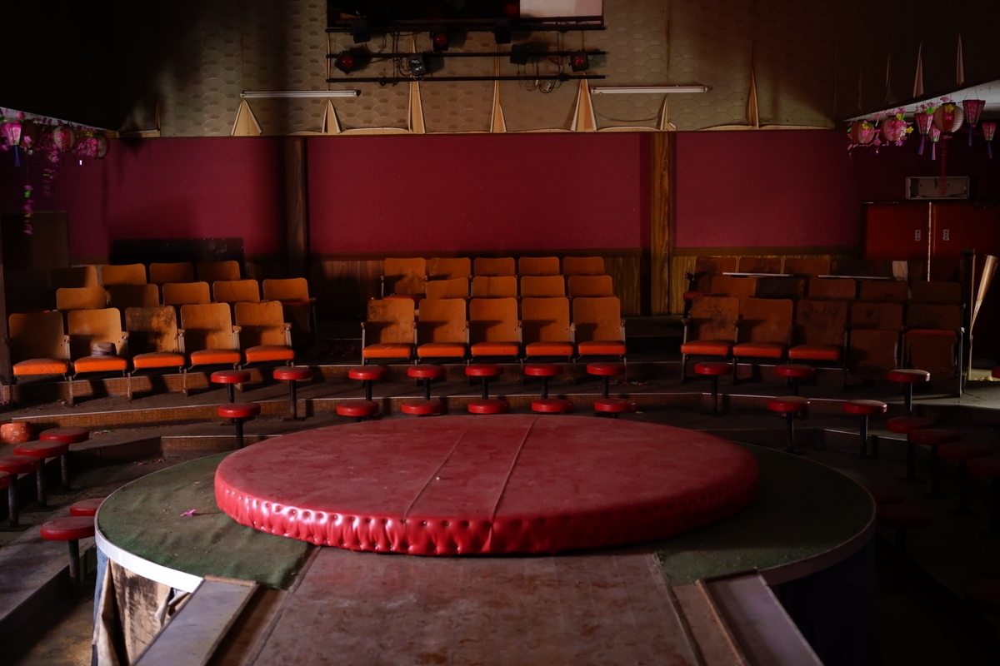

# ストリップ劇場の思い出

参考: [傑作ストリップ](https://montypython.fandom.com/wiki/Secretary_of_State_Striptease)

これは、２０２０年頃の話だったろうか？

岡山の県北にいくつかある温泉街の内の一つに、ストリップ劇場の廃墟があった、今もあるかもしれないが。かつて、ノスタルジーを求めて、廃墟を巡る趣味を持っていたので、惹かれてはいたが、場所が場所なのでなかなか行く気分にもなれず。廃墟巡りに慣れて飽きた頃に、条件に恵まれたので、惰性で行ってみることにした。

所々抜け落ちた階段を登ると、割れたガラスの散乱する真っ暗なエントランスがお迎えといった塩梅で、なかなか悲惨な状態だったが、中央の劇場はかなり綺麗な状態で残っていた。舞台裏に回ると、床が盛大に抜け落ちていたりと、これまた悲惨な状態だったので、それ以上探索することを諦め、客席で舞台を眺め、過去に思いを馳せるに留めた、いっそ過去を再現してやれば良かったかもしれない。

ストリップ劇場というのは、どこから来た文化なのだろうか。日本においては、アマノウズメが何かと引き出されるが、各国の神話においても女性器を晒すことが呪術的な意味を持つケースも多く、ストリップそのもの根源は特定不可能に思うが、それが劇場という形で資本化された契機というのは少々気になる。学が浅いので、性風俗の歴史は引き出しが特にないが、かのR.P.ファインマンや、上の参考にあげたように戦後の英語圏では、市民権を持っていたと考えられる。日本において、ストリップ小屋となると、どうもバブル・昭和のイメージがついて離れないのは私だけだろうか。

それはさておき、ストリップ劇場は、昭和期には各地にあったようだが、すっかり衰退し、大都市でもなければお目にかかることも難しくなっている。このまま消滅するかはともかく、これ以上衰退する前に、折角の機会のなのもあり行ってみたくなった。単騎でなければネタとしては弱いを標榜する私であるが、印象の良くない性産業に単騎突入する度胸は湧かず、道連れを探し求めていた。幸い、阿呆であることを良しとする土壌に支えられた後輩達がいたので、無理やり飯を奢ってヨモツヘグイだと連れ出すことに成功した。難色を示していたのはいうまでもない、チキンめ！

入り口のガードマンの物腰は落ち着いていて、受付もギャルなお姉さん方と、印象改善に熱心なのだろうか、思ったよりも入りやすい店舗であった。やたらスーツをきっちり着こなしたリーマンから、ドンキホーテにいそうなアベックまで、客層はまちまち。キャットウォークの如く張り出した舞台の先に、円形の台座が置いてあるフォーマットは廃墟も同じで、これがストリップの最適解なのだろうか。音楽が流れ、厚着した女の子が登場して踊り出す。舞台が狭い割には、高く作られているおかげだろう、女の子が巨大に見える。

参考に挙げたように流麗に脱いでいく名人芸を期待していたが、それほどでもなく、曲の合間の衣装替え？としての脱衣量の方が多いのは、少々残念であった。回転する円形台座の上で、全裸になり堂々たる開脚を披露すると、観客がなぜか拍手する。ここが拍手する場面なのかと、呆気に取られるばかりで特に興奮もできず終えてしまった。終曲後、お捻りを渡すと、眼前で開脚を披露してくれるしょうもないボーナスタイムがあったが、やたらスーツを着こなしたリーマンが丁寧に包んだお捻りを渡していたのは印象的であった。全体的に、テンポ良く進むので飽きるほどでもなかった。

帰り道、存外興奮していたのか、疲れからか、信号無視で切符を切られ、風俗帰りに警察に捕まった男と後輩達から揶揄されることになったのは今となっては良い思い出である。
